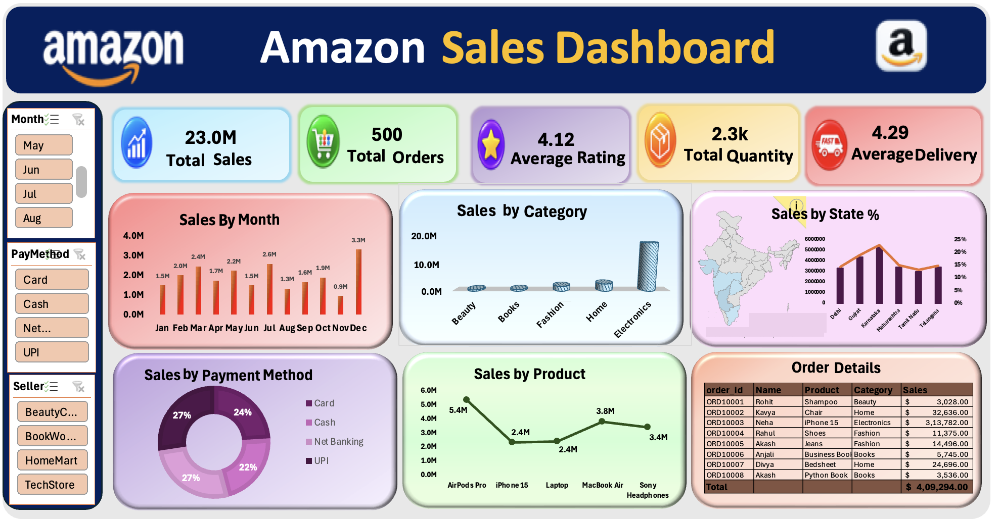

# Amazon Sales Dashboard | Microsoft Excel

## Project Overview

This project is an interactive **Amazon Sales Dashboard built in Microsoft Excel**.

The goal was to transform raw sales transaction data into a clear dashboard that helps analyze overall sales performance, product and category performance, monthly trends, seller contribution, payment methods, customer activity, and state-wise sales.

The project follows a practical Excel data-analysis workflow:

**Raw Data → Data Preparation → Pivot Tables → Pivot Charts → Slicers → Dashboard → Business Insights**

---

## Dataset at a Glance

- **500** transaction records
- **13** columns
- **20** unique customers
- **21** products
- **5** major categories
- **6** states
- **4** sellers
- **4** payment methods
- **2025** data
- **January to December** monthly coverage

### Categories

- Beauty
- Books
- Electronics
- Fashion
- Home

### Payment Methods

- Card
- Cash
- Net Banking
- UPI

---

## Raw Data Structure

| Column | Description |
|---|---|
| `Order_ID` | Unique identifier for each order |
| `Date` | Transaction date |
| `Customer_Name` | Customer associated with the transaction |
| `Product` | Product purchased |
| `Category` | Major product category |
| `State` | Customer/order location |
| `Seller` | Seller associated with the transaction |
| `Payment_Method` | Payment method used for the order |
| `Sales` | Sales value of the transaction |
| `Quantity` | Quantity purchased |
| `Rating` | Customer rating |
| `Delivery` | Delivery-related value recorded in the dataset |
| `Month` | Month used for monthly sales analysis |

---

## Project Objective

The dashboard was created to answer practical business questions:

- What are the total sales and total order volume?
- How do sales change from month to month?
- Which product categories generate the most sales?
- Which products are the major sales contributors?
- Which states contribute the most sales?
- Which payment methods contribute the most sales?
- Which sellers generate higher sales?
- Which customers contribute more sales?
- What are the overall rating, quantity, and delivery metrics?

---

## Key KPIs

| KPI | Result |
|---|---:|
| Total Sales | **$23,006,417** |
| Total Orders | **500** |
| Average Rating | **4.12** |
| Total Quantity | **2,280** |
| Average Delivery | **4.29** |
| Unique Customers | **20** |

---

## Dashboard Analysis

### 1. Sales by Month

The monthly analysis tracks sales from January to December 2025.

- **Highest sales month:** December — **$3,297,187**
- **Lowest sales month:** November — **$948,995**
- March and July also show strong sales levels.

The monthly view helps identify periods of higher and lower sales activity for planning and further investigation.

### 2. Sales by Category

| Category | Sales | Sales Share |
|---|---:|---:|
| Electronics | $17,463,533 | 75.9% |
| Home | $2,691,079 | 11.7% |
| Fashion | $1,790,583 | 7.8% |
| Books | $570,604 | 2.5% |
| Beauty | $490,618 | 2.1% |

**Key observation:** Electronics is the dominant category and contributes approximately **75.9%** of total sales.

### 3. Sales by Product

Top products by sales include:

| Product | Sales |
|---|---:|
| AirPods Pro | $5,398,413 |
| MacBook Air | $3,842,259 |
| Sony Headphones | $3,437,668 |
| Laptop | $2,432,276 |
| iPhone 15 | $2,352,917 |

**Key observation:** AirPods Pro is the highest-sales product in the dataset.

### 4. Sales by State

| State | Sales |
|---|---:|
| Karnataka | $5,312,858 |
| Gujrat | $4,389,497 |
| Maharashtra | $3,463,152 |
| Telangana | $3,436,390 |
| Delhi | $3,353,882 |
| Tamil Nadu | $3,050,638 |

**Key observation:** Karnataka records the highest sales contribution among the six states.

### 5. Sales by Payment Method

| Payment Method | Sales | Sales Share |
|---|---:|---:|
| UPI | $6,313,492 | 27.4% |
| Net Banking | $6,132,531 | 26.7% |
| Card | $5,522,910 | 24.0% |
| Cash | $5,037,484 | 21.9% |

**Key observation:** UPI has the highest sales contribution among the four payment methods.

### 6. Seller Performance

| Seller | Sales |
|---|---:|
| TechStore | $6,745,970 |
| BookWorld | $6,085,172 |
| HomeMart | $5,737,818 |
| BeautyCare | $4,437,457 |

**Key observation:** TechStore has the highest sales contribution among the four sellers.

### 7. Customer Performance

Top sales-contributing customers in the analysis include:

| Customer | Sales |
|---|---:|
| Sneha | $2,391,968 |
| Kavya | $1,901,058 |
| Naveen | $1,689,680 |
| Neha | $1,582,251 |
| Divya | $1,544,010 |

**Key observation:** Sneha is the highest-sales customer in the dataset.

### 8. Order and Operational Metrics

The dashboard also brings together:

- **500 total orders**
- **2,280 total quantity**
- **4.12 average rating**
- **4.29 average delivery value**

The Delivery field is treated as the dataset's recorded delivery measure because the source workbook does not specify a separate unit.

---

## Excel Skills Used

- Data preparation and organization
- Pivot Tables
- Pivot Charts
- Slicers
- KPI reporting
- Data aggregation
- Category analysis
- Product analysis
- State-wise analysis
- Seller analysis
- Payment-method analysis
- Monthly trend analysis
- Data visualization
- Dashboard design
- Business insight generation

---

## Interactive Dashboard

The dashboard includes slicers for:

- **Month**
- **Payment Method**
- **Seller**

These filters allow the user to focus on selected portions of the data without rebuilding the report.

---

## Business Insights

- Electronics is the major revenue-driving category, accounting for approximately **75.9% of total sales**.
- AirPods Pro is the leading product by sales.
- December has the highest monthly sales, while November has the lowest.
- Karnataka is the highest-sales state in the dataset.
- UPI has the highest sales contribution among the payment methods.
- TechStore contributes the highest seller sales.
- The customer analysis identifies high-sales customers for further segmentation and retention analysis.
- The dashboard combines sales with quantity, ratings, orders, and delivery-related measures to provide a broader view of performance.

---

## What the Dashboard Helps Analyze

The final dashboard provides a single-screen view for:

- Monitoring overall sales and order performance
- Comparing category and product performance
- Tracking monthly sales movement
- Comparing state-wise sales
- Understanding payment-method contribution
- Comparing seller performance
- Reviewing customer sales contribution
- Exploring the data interactively using slicers

---

## Dashboard Preview

The repository includes a dashboard screenshot showing the final layout and analysis.

---

## Files

- `Amazon_Sales_Dashboard.xlsx` — Excel workbook
- `Dashboard_Preview.png` — dashboard screenshot
- `Amazon_Sales_Dashboard_Project_Documentation.docx` — detailed project documentation
- `README.md` — project overview

---

## Project Outcome

This project demonstrates how Microsoft Excel can be used to take raw transaction-level data and convert it into a structured, interactive business dashboard.

The workflow covers:

**Raw Data → Data Analysis → Visualization → Interactive Reporting → Business Insights**
